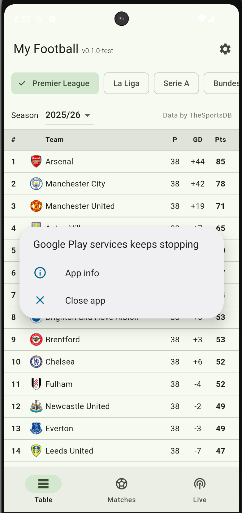
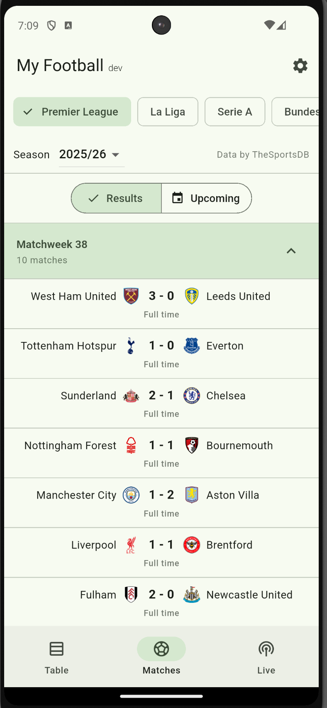

# My Football
> Track the major football leagues

My Football is a Flutter app for following the big European football leagues.
It shows live league **standings**, **fixtures** (recent results and upcoming
matches grouped by matchweek), and per-team **schedules**. Adding a
[TheSportsDB](https://www.thesportsdb.com/) API key in Settings unlocks the
premium tier, which adds a **Live scores** tab and richer team data.

<a href="table.png"></a>
<a href="matches.png"></a>

## Download & install (Android)

Prebuilt Android APKs are published on the repository's
[**Releases**](../../releases) page, built automatically by GitHub Actions.

1. Open the latest release and download **`app-release.apk`** (the universal
   build that works on any device). Advanced users can instead pick the smaller
   ABI-specific APK matching their phone (`arm64-v8a`, `armeabi-v7a`, or
   `x86_64`).
2. On the phone, allow **Install unknown apps** for your browser or file
   manager when prompted.
3. Open the downloaded APK and confirm installation.
4. Launch the app. To enable the premium features, open **Settings** and paste a
   TheSportsDB API key (see *Free vs. premium* below).

> **iPhone:** direct downloads are not available. Apple does not permit
> installing apps outside the App Store, so iOS requires building from source on
> a Mac (see below) or App Store distribution.

## How it works

Data comes from the [TheSportsDB](https://www.thesportsdb.com/) sports API. The
app talks to two endpoints:

- **v1 (free):** standings, season fixtures, and team events using the shared
  free key. No sign-up required.
- **v2 (premium):** live in-play scores and fuller team schedules, authenticated
  with a personal API key sent in the `X-API-KEY` header.

Network responses are cached in `shared_preferences` with a short TTL to reduce
requests and keep the UI responsive; the cache is cleared automatically when the
API key changes.

### Free vs. premium

| Feature                         | Free | Premium (API key) |
|---------------------------------|:----:|:-----------------:|
| League standings                |  ✅  |        ✅         |
| Fixtures (results & upcoming)    |  ✅  |        ✅         |
| Team schedule                   |  ✅  |     ✅ (fuller)   |
| Live scores tab                 |  —   |        ✅         |

Enter your key in **Settings**; it is stored securely on-device via
`flutter_secure_storage` and never committed to the repo.

## Project structure

The code follows a feature-first layout under `lib/`:

```
lib/
├─ main.dart, app.dart          # entry point and root widget
├─ config/                      # build-time config (e.g. app_version)
├─ core/
│  ├─ api/                      # TheSportsDB v1 & v2 clients, exceptions
│  └─ storage/                  # secure key store + TTL cache store
├─ models/                      # Fixture, League, TeamStanding
├─ providers/                   # app-wide Riverpod providers (API key, clients)
├─ features/
│  ├─ home/                     # bottom-nav shell
│  ├─ standings/                # league table
│  ├─ fixtures/                 # results & upcoming, grouped by matchweek
│  ├─ live/                     # live scores (premium)
│  ├─ team/                     # team detail & schedule
│  └─ settings/                 # API key entry & validation
└─ shared/widgets/              # reusable error / message views
```

Each feature groups its `view`, `repository`, and `providers` together.

## Tech stack

- **[Flutter](https://flutter.dev/) / Dart** — cross-platform UI.
- **[flutter_riverpod](https://riverpod.dev/)** — state management and
  dependency injection.
- **[dio](https://pub.dev/packages/dio)** — HTTP client for the TheSportsDB API.
- **[flutter_secure_storage](https://pub.dev/packages/flutter_secure_storage)** —
  encrypted on-device storage for the premium API key.
- **[shared_preferences](https://pub.dev/packages/shared_preferences)** —
  lightweight TTL response cache.

## Getting started

Fetch dependencies:

```bash
flutter pub get
```

Run on a connected device or emulator:

```bash
flutter run                # auto-selects a device
flutter run -d <deviceId>  # target a specific device (see: flutter devices)
```

## Running on a physical Android phone

1. **Enable Developer options** on the phone: Settings → About phone → tap
   **Build number** seven times.
2. **Enable USB debugging**: Settings → System → Developer options → **USB
   debugging** on.
3. **Connect the phone to the computer** with a **data-capable** USB cable
   (charge-only cables will not work). Plug directly into the machine rather than
   through a hub or dock.
4. **Set the USB mode** on the phone to **File transfer / MTP** via the USB
   notification — some phones default to charge-only, which blocks the data
   connection.
5. **Authorize the computer**: unlock the phone and accept the *Allow USB
   debugging?* prompt (tick *Always allow from this computer* to skip it next
   time).
6. **Verify the device is detected**:

   ```bash
   # platform-tools ships with the Android SDK, e.g.
   #   macOS:  $HOME/Library/Android/sdk/platform-tools
   adb devices -l     # should list your phone with state "device"
   flutter devices    # should show the phone
   ```
7. **Build, install, and launch** on the phone:

   ```bash
   flutter run -d <deviceId>   # deviceId from `flutter devices`, e.g. 56041FDCH00CDN
   ```

   Flutter builds the debug APK, installs it, and starts a live debug session
   (hot reload with `r`, hot restart with `R`). The app also stays installed in
   the app drawer after you quit the session.

## Running on a physical iOS phone

Deploying to an iPhone requires a **Mac with Xcode** installed (plus its
command-line tools and CocoaPods).

1. **Sign in with an Apple ID in Xcode**: Xcode → Settings → Accounts → add your
   Apple ID. A free Apple ID works for on-device development (with a 7-day
   signing validity); a paid Apple Developer account removes that limit.
2. **Set the signing team** for the app. Either open the iOS project in Xcode:

   ```bash
   open ios/Runner.xcworkspace
   ```

   then select the **Runner** target → **Signing & Capabilities** → pick your
   **Team** and let Xcode manage signing. Xcode will assign a unique bundle
   identifier if the default is taken.
3. **Connect the iPhone** with a cable and **trust the computer**: on the phone,
   tap **Trust** on the *Trust This Computer?* prompt and enter your passcode.
4. **Enable Developer Mode** (iOS 16+): Settings → Privacy & Security →
   **Developer Mode** → on, then restart the phone when prompted.
5. **Verify the device is detected**:

   ```bash
   flutter devices    # should list your iPhone
   ```

6. **Build, install, and launch** on the phone:

   ```bash
   flutter run -d <deviceId>   # deviceId from `flutter devices`
   ```

   The first build is slower (CocoaPods + native compile) and starts a live
   debug session (hot reload with `r`, hot restart with `R`).
7. **Trust the developer certificate on the phone** the first time you launch a
   build signed with a personal team: Settings → General → **VPN & Device
   Management** → tap your developer profile → **Trust**. Then reopen the app.

## Testing

```bash
flutter analyze lib test integration_test
flutter test                   # unit and widget tests
flutter test integration_test  # end-to-end integration test
```

## Release signing

Release APKs are signed with a persistent keystore so that updates install over
previous versions without conflicts. The key is stored as GitHub Actions secrets
and decoded at build time.

**One-time setup:**

1. Generate the keystore. Keep the file safe and out of git — if you lose it you
   can no longer ship updates that install over existing installs.

   ```bash
   keytool -genkey -v \
     -keystore android/release-keystore.jks \
     -keyalg RSA -keysize 2048 -validity 10000 \
     -alias release
   ```

2. Add two repository secrets (Settings → Secrets and variables → Actions):

   | Secret              | Value                                                      |
   |---------------------|------------------------------------------------------------|
   | `KEYSTORE_BASE64`   | `base64 -i android/release-keystore.jks` (copy the output) |
   | `KEYSTORE_PASSWORD` | The password you set above (used for both store and key)   |

The workflow writes `android/key.properties` from these secrets before building.
Locally, when `key.properties` is absent, the build falls back to the debug
signing key.

## License

[MPL-2.0](LICENSE).
