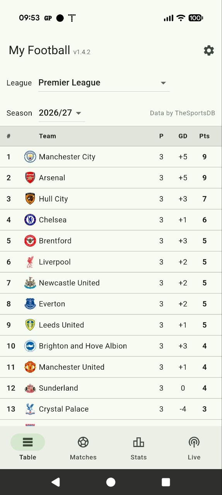
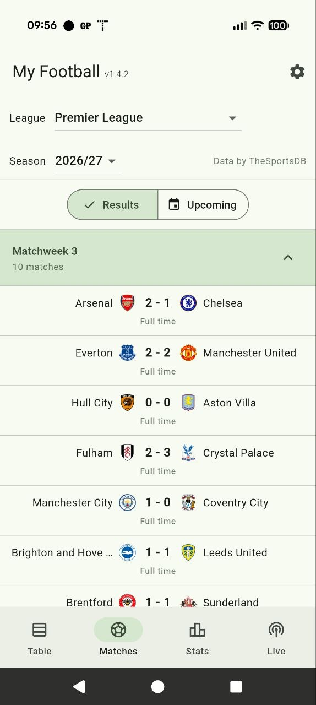
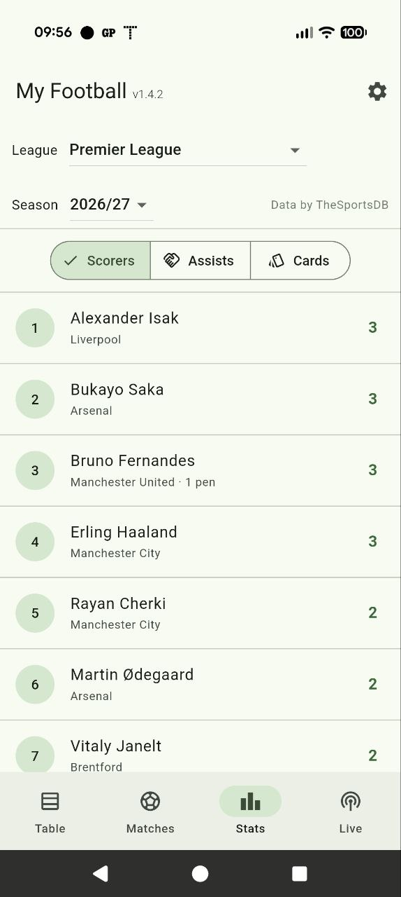
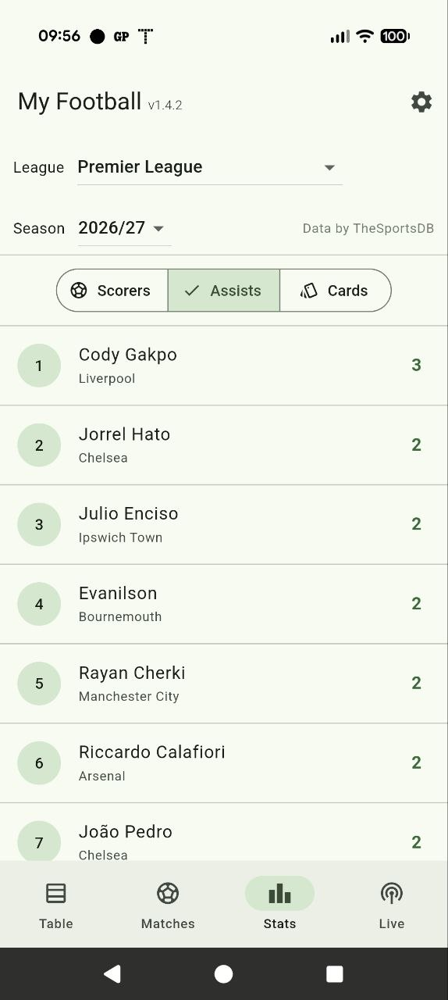
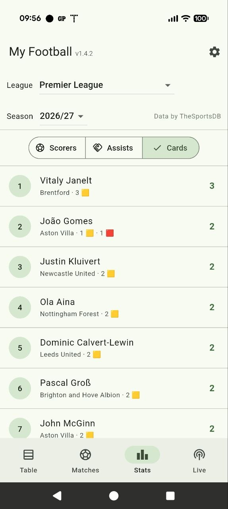
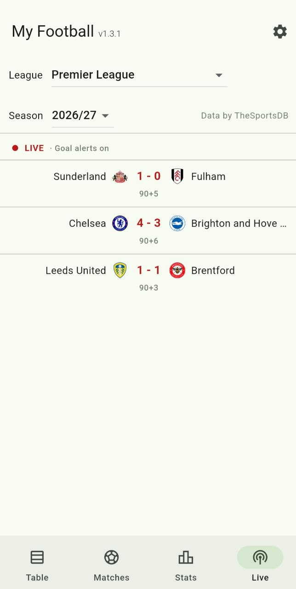
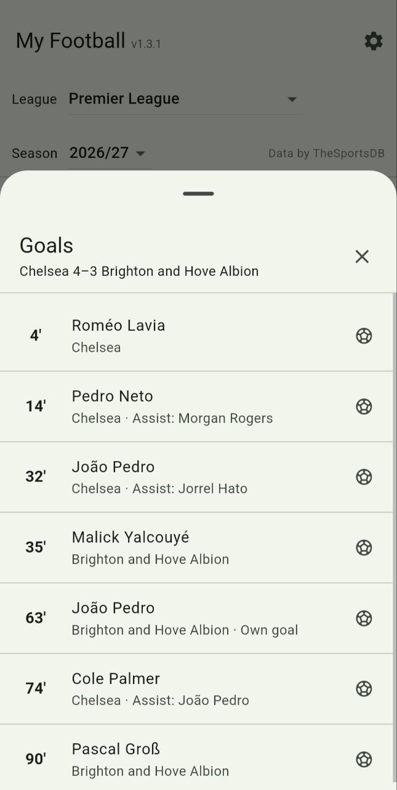
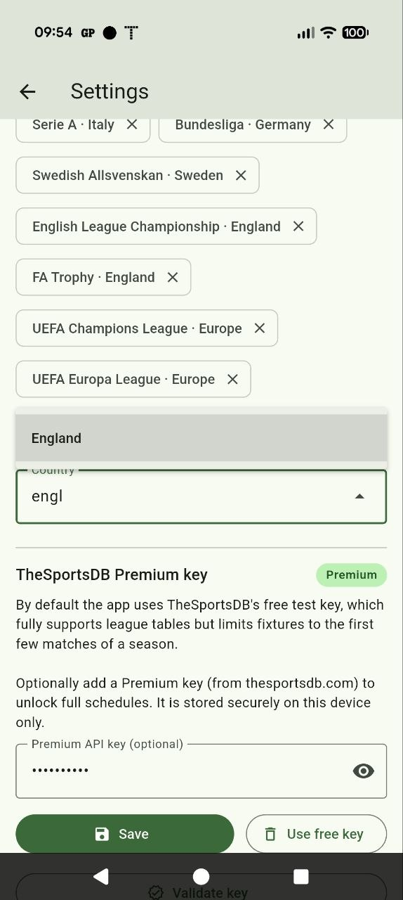
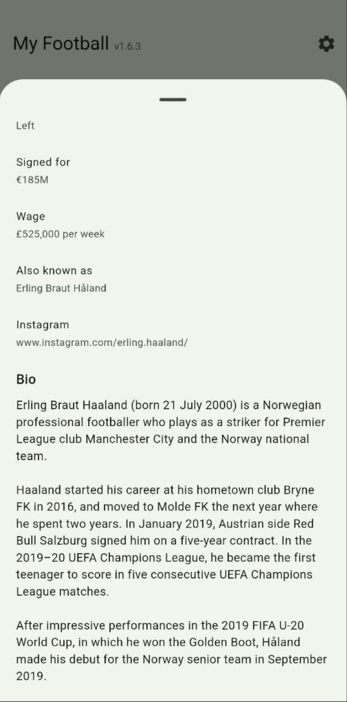
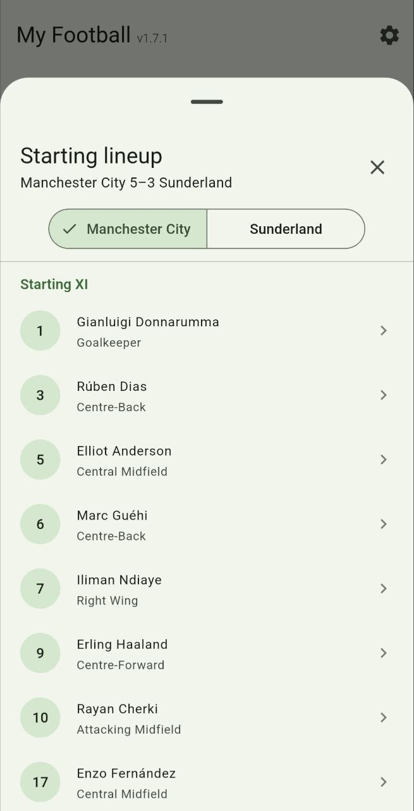

# My Football
> Track the major football leagues

My Football helps you follow the major European football leagues.
It shows live league **standings**, **fixtures** (recent results and upcoming
matches grouped by matchweek), and per-team **schedules**. Adding a
[TheSportsDB](https://www.thesportsdb.com/) API key in Settings unlocks the
premium tier, which adds a **Live scores** tab (with phone alerts when a goal
is scored while that tab is open), **Player stats** leaderboards
(top scorers, assists & cards, with player drill-down from each row), and
richer team data.

## Screenshots

## Using the app

### Choose a league and season

- Tap `League` above the screen to choose a followed league.
- Tap `Season` to choose the season to display.
- Open `Settings` to change followed leagues. Choose a country, then select or clear leagues.
- Keep at least one league selected.

### Move between screens

- Tap `Table` to view league standings.
- Tap `Matches` to view results and upcoming fixtures.
- Tap `News` to see headlines for the selected league.
- If you have a Premium key, tap `Stats` or `Live` to open those screens.
- Tap the settings icon in the top-right corner to open `Settings`.

### Table

- Tap a team row to open that team's details and schedule.
- With a Premium key, double-tap a team row to open the team's latest line-up.
- Pull down on the table to refresh the standings.

### Matches and team schedules

- Tap `Results` or `Upcoming` to switch between finished matches and future fixtures.
- Tap a matchweek heading to expand or collapse its fixtures.
- In `Results`, tap a finished match to view its goal details.
- Double-tap a finished match to view its line-up.
- In `Upcoming`, double-tap a future match to set a kick-off reminder.
- A single tap on an upcoming match does not open it.
- A reminder is available only before kick-off for a match that is not postponed.
- Choose `Off`, `15 min`, `30 min`, `60 min`, or `120 min` before kick-off.
- Tap `Save` to schedule the reminder. Choose `Off` and save to cancel it.
- For a new reminder, `15 min` is selected by default.
- Allow notifications when prompted. Without permission, reminders stay silent until you enable notifications in system settings.
- On a team's details page, tap a finished match for goal details.
- Double-tap a finished match to view its line-up.
- Double-tap an eligible upcoming match to set a reminder.
- Pull down on a match list or team schedule to refresh it.

### News

- Add your own free GNews API key in `Settings` to use the News tab. News is
  available to Free and Premium users.
- Pull down on News to fetch current headlines for the selected league. Opening
  the tab does not make a network request; saved headlines are shown first.
- Tap a headline to expand its description, then tap the article button to open
  the source in the in-app browser.
- Set the headline age limit to 1, 3, or 7 days in `Settings` → `News max age`.
  The default is 1 day.

### Stats and Live

- In `Stats`, tap `Scorers`, `Assists`, or `Cards` to choose a leaderboard.
- Tap a player row to open that player's details. Player details need a Premium key.
- In a match line-up, tap the team selector to switch between the two teams.
- Tap a player row to open details when they are available.
- In `Live`, tap a match to view its goal details. Scores refresh while this screen is open.
- The first time you open `Live`, allow notifications to receive goal alerts while this screen is open.
- Pull down on `Stats` or `Live` to refresh its data.

### Settings

- To add a Premium key, enter it in `Settings` and tap `Save`.
- Tap `Validate key` to test the key.
- Tap the eye icon to show or hide the key.
- Tap `Use free key` to remove the saved key.
- Add and validate your own GNews key in `Settings` to enable News.
- Set `News max age` in `Settings` to 1, 3, or 7 days (default: 1 day).
- To follow a league, choose its country in `Settings`, then tap its checkbox.
- Tap a selected checkbox to unfollow that league. Keep at least one league selected.

## Download & install (Android)

Prebuilt Android APKs are published on the repository's
[**Releases**](../../releases) page.

1. Open the latest release and download **`app-release.apk`** (the universal
   build that works on any device). Advanced users can instead pick the smaller
   ABI-specific APK matching their phone (`arm64-v8a`, `armeabi-v7a`, or
   `x86_64`).
2. On the phone, allow **Install unknown apps** for your browser or file
   manager when prompted.
3. Open the downloaded APK and confirm installation.
4. Launch the app. To enable the premium features, open **Settings** and paste a
   TheSportsDB API key (see *Free vs. premium* below).

At startup, the app checks for a newer version at most once every 24 hours.
If one is available, tap `Update now` to open its release page, or tap `Later`
to close the prompt. If the app cannot reach GitHub, no prompt appears.

> **iPhone:** direct APK downloads are not available. For iOS source-build
> instructions, see [DEVELOPERS.md](DEVELOPERS.md).

## Free vs. premium

The Free key just gives you a small sample data set, just to give you an
idea of how it looks like. You'll need a Premium key to have any real
use/joy of the App (Note: the App is not sponsored or have anything to
do with the `thesportsdb.com` apart from enabling the display of the data
obtained from them).

The app stores your key securely on this device.

## For developers

For setup, project layout, tests, device runs, and releases, see [DEVELOPERS.md](DEVELOPERS.md).

## License

[MPL-2.0](LICENSE).
